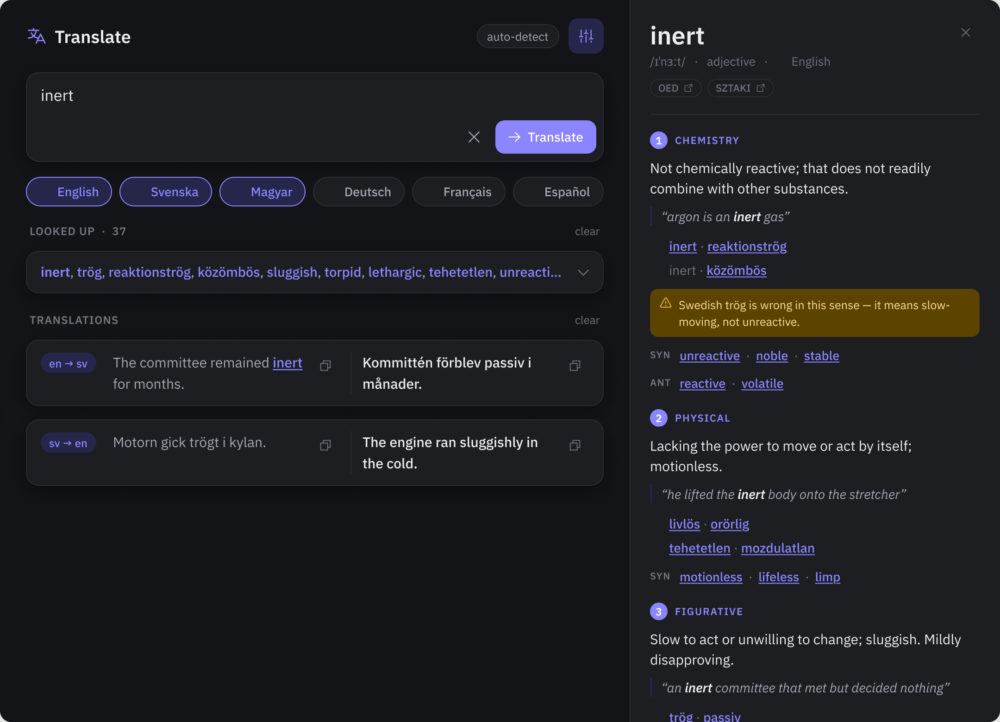

# Dictionary Panel — settled design

Companion to [CONTEXT.md](../CONTEXT.md) (vocabulary) and [Docs/adr/](./adr/) (the six
decisions that were hard to reverse). This file holds everything else that was settled —
the rules that are easy to change but would otherwise only exist in someone's head.



Mock: **[Translate — Dictionary Panel](https://www.figma.com/design/qzKZ390nWqLUUktbtJfKYi/Translate---Dictionary-Panel)**
— light and dark frames, plus a Notes column of the same decisions on canvas. Renders are
checked in as [dark](./dictionary-panel-dark.png) and [light](./dictionary-panel-light.png)
so the design survives without Figma access.

## When a Lookup happens

Exactly one word in the input triggers a Lookup. Two or more words never do. There is no
dictionary toggle and no word-count threshold — nothing to remember, and no cliff at four
words versus five.

A single word produces **only** Entries; no Translation Cards are created. The Panel's
Equivalents rows already give the translation into every Enabled Language split by Sense,
which is strictly more than a Card would show. The Word Trail is the history for
single-word input.

Clicking any word already on screen is also a Lookup — in a Translation Card, in the Word
Trail, or in another Entry's Equivalents, Synonyms or Antonyms. Clicking a foreign
Equivalent looks that word up *in its own language*, which is where the round trip pays off:
looking up `trög` from an English Entry shows which English Senses it does and doesn't
reach.

## Not-a-clean-headword cases

| Input | Result |
| --- | --- |
| `gick` | Entry for `gå`, with `gick — past tense of gå` shown above the Headword |
| `trögare` | Entry for `trög`, same treatment |
| `inret` | No Entry. *Did you mean **inert**?* — the suggestion clickable |
| `Stockholm` | No Entry, with a one-line note that it is a proper noun |
| `asdfgh` | No Entry |

The last three are one shape: zero Entries, an optional note, an optional suggested word.

## Layout

- Opening the Panel widens the window to about **1080**. The app column keeps its 680 (the
  root grid already caps and centres content at that width); the Panel takes ~400 on the
  right with its own scroll and a hairline divider.
- The Panel is **not** an overlay. At 680 wide, a 400px drawer leaves 280 for the app —
  the two-column Translation Cards collapse at that width, so it would hide the thing being
  clicked.
- The Word Trail sits above the translations heading as **one collapsed line**, truncated,
  with an expander. Measured: 33 words wrapped to 104px, so the full hundred would have run
  to roughly a third of the window height.
- Translation Cards put the direction pill in a **fixed-width first column** rather than on
  its own row above — about 30px shorter per card.
- Senses stay expanded; no accordion. Comparing Senses side by side is the point.

## Visual details

- **Icons: Phosphor, regular weight.** `translate`, `faders`, `x`, `arrow-right`, `copy`,
  `caret-down`, `warning`, `arrow-square-out`. This replaces the Material Symbols font on
  the web and the Material icon path data in `App.axaml`.
- **Flags stay as emoji.** Phosphor ships no country flags (only generic `flag`,
  `flag-banner`, `flag-checkered`, `flag-pennant`), and a bundled flag icon set was not
  worth a second dependency.
- The Headword is highlighted wherever it appears inside an Example.
- Source Links are scoped to the Entry's language: OED for English, SAOL for Swedish,
  SZTAKI for English⇄Hungarian.
- The Panel needs its own **copy** affordance per Equivalent — single words no longer
  produce a Card to copy from.

## Concrete values

Everything with a number in it, in one place.

| Value | Setting |
| --- | --- |
| Senses per Entry | **max 4**, ordered most common first |
| Word Trail length | **100** entries (word + its Entries; see ADR-0003) |
| Prefetch Set default | all 6 languages the app knows |
| Window width with Panel open | **1080** (app column 680 + Panel 400) |
| Panel width | **400**, own scroll, 1px left divider |
| Trail strip | 1 line, truncated, expander |

### Material 3 `warning` role

Tones derived from an amber source: light = 40 / 90 / 10, dark = 80 / 30 / 90.
Regenerate from Material Theme Builder if the source colour changes — these are the shape.

| Role | Light | Dark |
| --- | --- | --- |
| `warning` (icon) | `#7A5900` | `#F2C14E` |
| `onWarning` | `#FFFFFF` | `#3F2E00` |
| `warningContainer` (box) | `#FFDF9E` | `#5C4300` |
| `onWarningContainer` (text) | `#261A00` | `#FFDF9E` |

Goes in both theme dictionaries in `App.axaml`, and mirrored into the web stylesheet as
unused custom properties (ADR-0006).

### Source Link URL shapes

Built from the Headword and the Entry's language. Patterns as supplied:

```
OED     https://www.oed.com/dictionary/{headword}_{pos}?tab=meaning_and_use
SAOL    https://svenska.se/?activeTab=saol&q={headword}&exactMatch=true
SZTAKI  https://szotar.sztaki.hu/search?fromlang=all&tolang=all&searchWord={headword}
```

OED's path needs a part-of-speech suffix and both OED and SAOL carry an entry `id` in the
originals — neither is derivable from the Headword alone, so the links land on a search or
disambiguation page rather than deep inside an entry. That is acceptable; the point is one
click to an authority, not a precise anchor.

### Phosphor icons

Regular weight, 256×256 viewBox, from `phosphor-icons/core` →
`assets/regular/{name}.svg`:
`translate`, `faders`, `x`, `arrow-right`, `copy`, `caret-down`, `warning`,
`arrow-square-out`.

## Model and limits

- Default model moves from `claude-opus-4-8` to **`claude-opus-5`** — identical pricing
  ($5/$25 per million tokens), one generation newer. One model for both Translations and
  Lookups.
- **`MaxTokens` must rise from its current 1000.** A capped Entry runs roughly 1200–1500
  tokens, and with structured outputs an overrun does not truncate gracefully — the JSON
  never closes and deserialisation throws.

### Measured, once the code existed

First real Lookups, all six languages in the Prefetch Set, `claude-opus-5`:

| Word | Effort | Time | Result |
| --- | --- | --- | --- |
| `inert` | high (default) | 56 s | 4 entries, 10 senses, 4 false-friend notes, 4176 output tokens |
| `inert` | **medium** | 39 s | the same 4 entries, 10 senses and 4 notes, 3022 output tokens |
| `inert` | low | 16 s | 3 entries, 5 senses, **no false-friend notes** |
| `trögare` | medium | 19 s | `trög`, 4 senses, `trögare — comparative of trög` |
| `asdfgh` | high | 4 s | zero Entries, a note, no suggestion |
| `inret` | high | 8 s | zero Entries, a note, suggested `inrett` |

So Lookups run at **medium**: it costs nothing visible against high and saves a third of the
wait. Low is not an option — it drops the False-friend Notes, which are the point of an Entry.
Translations stay at high; they take about 4.5 s at any effort, so there is nothing to win.

A whole Entry set is far more than the ~1500 tokens assumed above, and a Lookup takes 20–40
seconds rather than a few. That is why the Panel has a progress line and says how long it takes.

## Carried assumptions

Recorded because they were decided in passing rather than asked about:

- The seeded example history is reworked to use phrases. Three of the six current examples
  are single words, which under the new trigger rule can no longer produce a Card — so a
  user could not reproduce what the demo shows.
- The Prefetch Set defaults to every language the app knows, narrowable in settings.
- Entries are not streamed. At ~1500 tokens a non-streaming request is well inside the
  timeout guidance.

## Deferred

**Window vibrancy / native chrome.** Avalonia can do translucency
(`TransparencyLevelHint`, which maps to NSVisualEffectView on macOS and Mica on Windows)
and an extended client area, but it cannot do macOS Liquid Glass — that is an AppKit/SwiftUI
material, and Avalonia renders its own surface rather than composing AppKit views.

Deferred rather than rejected: the app already follows the system light/dark theme and
looks at home on macOS, and translucency would cost legibility on the densest text in the
app — the Panel's 12.5px warning text and faint synonym rows. It is also orthogonal to this
feature and belongs in its own change.
