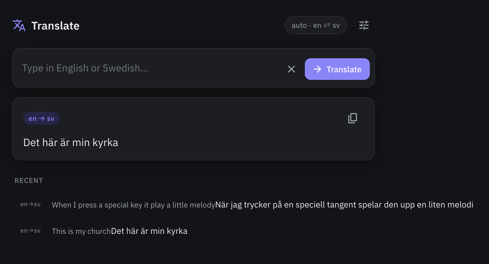

# Translate · EN ⇄ SV



A small, personal English ⇄ Swedish translator powered by Claude. Type in either
language; the model detects the direction, translates in a natural, idiomatic
style, and returns a guaranteed-shape result via the Anthropic SDK's **structured
outputs** — no fragile JSON-from-markdown parsing.

The same translation core drives two front-ends: a cross-platform **Avalonia
desktop app** and a private **ASP.NET web app**.

## Features

- **Bidirectional, auto-detected** — English→Swedish or Swedish→English, decided per input.
- **Structured outputs** — the model returns JSON validated against a schema, mapped to a typed `TranslationResult`.
- **Configurable style** — a writing-style guide steers tone; defaults to natural, idiomatic, slightly casual.
- **Configurable model** — defaults to `claude-opus-4-8`; override per deployment.
- **Desktop niceties** — recents (last 8), copy-to-clipboard, Enter-to-translate (Shift+Enter for newline), persisted settings, follows OS light/dark theme.
- **One shared core** — desktop and web both call `Translator.Core`; only the key handling differs.

## Architecture

| Project | What it is |
| --- | --- |
| `Translator.Core` | Class library. The only place that talks to Anthropic — builds the prompt, calls the API with structured outputs, returns `TranslationResult`. |
| `Translator.Desktop` | Avalonia (MVVM) native app. Calls Core directly; persists key, style, and history to JSON in the OS app-data dir. |
| `Translator.Web` | ASP.NET Core minimal API. Serves a static page and a `POST /api/translate` endpoint that calls Core with a server-held key. |
| `Translator.Core.Tests` | xUnit. Covers prompt building and result mapping (no network). |

**Stack:** C# / .NET 10 · [Anthropic C# SDK](https://www.nuget.org/packages/Anthropic) · Avalonia · ASP.NET Core · xUnit

## Prerequisites

- [.NET 10 SDK](https://dotnet.microsoft.com/download)
- An [Anthropic API key](https://console.anthropic.com/)

## Install

```bash
git clone https://github.com/laszloprekop/ClaudeTranslate.git
cd ClaudeTranslate
dotnet build
```

Run the tests to confirm everything's wired up:

```bash
dotnet test
```

## Usage

### Desktop

```bash
export ANTHROPIC_API_KEY=sk-ant-...      # or set the key in-app under Settings
dotnet run --project src/Translator.Desktop
```

Type a phrase and hit **Translate** (or press Enter). Open **Settings** to paste
your API key and tweak the writing style — both persist between runs. On macOS,
settings live at `~/Library/Application Support/Translator/settings.json`.

### Web

```bash
export ANTHROPIC_API_KEY=sk-ant-...
dotnet run --project src/Translator.Web
```

Open the URL printed on startup (e.g. `http://localhost:5000`). The browser never
sees the API key — it posts to `/api/translate`, which calls Claude server-side.

```bash
curl -s -X POST localhost:5000/api/translate \
  -H 'content-type: application/json' \
  -d '{"text":"Hej, hur mår du?"}'
# → {"source":"Swedish","target":"English","translation":"Hi, how are you?"}
```

## Configuration

The API key and model are resolved in this order:

| Setting | Desktop | Web |
| --- | --- | --- |
| API key | in-app Settings, else `ANTHROPIC_API_KEY` | `Anthropic:ApiKey` config, else `ANTHROPIC_API_KEY` |
| Model | `claude-opus-4-8` (in-app Settings) | `Anthropic:Model` config, else `claude-opus-4-8` |

The web app throws a clear error at startup if no key is configured.

## Project structure

```
src/
  Translator.Core/      # prompt + Anthropic call + result schema
  Translator.Desktop/   # Avalonia MVVM app
  Translator.Web/       # ASP.NET minimal API + static page
tests/
  Translator.Core.Tests/
Docs/
  coding-steps.md       # step-by-step build guide
```

## Development

```bash
dotnet watch --project src/Translator.Desktop   # desktop hot-reload
dotnet watch --project src/Translator.Web        # web hot-reload
dotnet build && dotnet test                      # full suite
```
