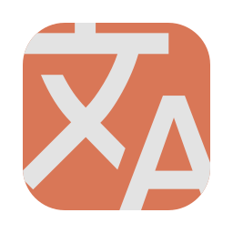
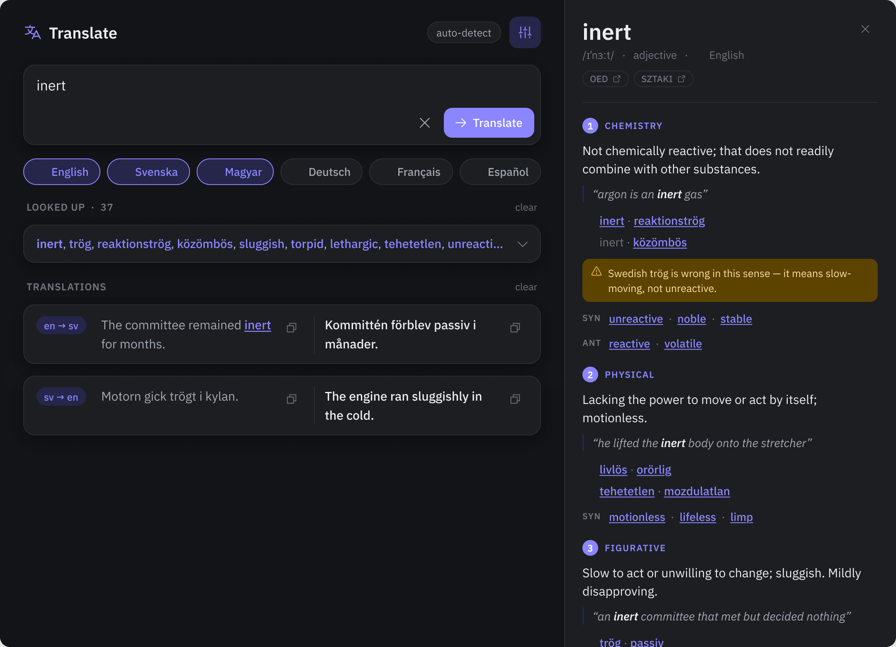

<p align="center">
  
</p>

# Translate · EN ⇄ SV

A small, personal English ⇄ Swedish translator powered by Claude. Type in either
language; the model detects the direction, translates in a natural, idiomatic
style, and returns a guaranteed-shape result via the Anthropic SDK's **structured
outputs** — no fragile JSON-from-markdown parsing.



The same translation core drives two front-ends: a cross-platform **Avalonia
desktop app** and a private **ASP.NET web app**.

## Features

- **Multi-language targets** — pick any of 🇬🇧 🇸🇪 🇭🇺 🇩🇪 🇫🇷 🇪🇸 via flag chips; one click translates to all checked languages in parallel, with the source auto-detected.
- **Structured outputs** — the model returns JSON validated against a schema, mapped to a typed `TranslationResult`.
- **Configurable style** — a writing-style guide steers tone; defaults to natural, idiomatic, slightly casual.
- **Dictionary panel (desktop)** — type one word and it is looked up instead of translated: an entry per language the word exists in, senses ordered most common first, and the equivalents for *each* sense rather than one flat list. False-friend notes warn where the obvious word is the wrong one. Every word on screen — in a card, in the trail, in an entry — is itself a lookup. A lookup takes 20–40 seconds.
- **Configurable model** — defaults to `claude-opus-5`; pick another in Settings, or override per deployment.
- **Stacked history** — original next to translation, each with its own copy button; seeded with showcase examples on first run and after clearing.
- **Desktop niceties** — Enter-to-translate (Shift+Enter for newline), selectable text everywhere, persisted settings, follows OS light/dark theme, packageable as a standalone macOS app.
- **One shared core** — desktop and web both call `Translator.Core`; only the key handling differs.

## Architecture

| Project | What it is |
| --- | --- |
| `Translator.Core` | Class library. The only place that talks to Anthropic — builds the prompt, calls the API with structured outputs, returns `TranslationResult`. |
| `Translator.Desktop` | Avalonia (MVVM) native app. Calls Core directly; persists key, style, and history to JSON in the OS app-data dir. |
| `Translator.Web` | ASP.NET Core minimal API. Serves a static page and a `POST /api/translate` endpoint that calls Core with a server-held key. |
| `Translator.Core.Tests` | xUnit. Covers prompt building, the lookup schema and result mapping (no network). |
| `Translator.Desktop.Tests` | xUnit. Covers the word trail, entry presentation and settings, and renders the real window headlessly (no network). |

**Stack:** C# / .NET 10 · [Anthropic C# SDK](https://www.nuget.org/packages/Anthropic) · Avalonia · ASP.NET Core · xUnit

## Prerequisites

- [.NET 10 SDK](https://dotnet.microsoft.com/download)
- An [Anthropic API key](https://console.anthropic.com/)

## Install

**Prebuilt apps** — grab the latest desktop app (macOS/Windows/Linux) or self-hosted web
server from [Releases](https://github.com/laszloprekop/ClaudeTranslate/releases); setup and
first-launch notes are in the **[install guide](./Docs/install.md)**.

Or build from source:

```bash
git clone https://github.com/laszloprekop/ClaudeTranslate.git
cd ClaudeTranslate
dotnet build
```

Run the tests to confirm everything's wired up:

```bash
dotnet test
```

## Usage

### Desktop

```bash
export ANTHROPIC_API_KEY=sk-ant-...      # or set the key in-app under Settings
dotnet run --project src/Translator.Desktop
```

Type a phrase and hit **Translate** (or press Enter; Shift+Enter breaks the line).
Type a *single* word and it is looked up instead: the dictionary panel opens on the
right and the window widens to make room. Open **Settings** for the API key, the
writing style, the model, and which languages a lookup asks for — all persist
between runs. On macOS, settings live at
`~/Library/Application Support/Translator/settings.json`.

To package a standalone macOS app bundle (`dist/Translate.app`):

```bash
./scripts/package-macos.sh          # osx-arm64 by default; pass a RID to override
```

### Web

```bash
export ANTHROPIC_API_KEY=sk-ant-...
dotnet run --project src/Translator.Web
```

Open the URL printed on startup (e.g. `http://localhost:5000`). The browser never
sees the API key — it posts to `/api/translate`, which calls Claude server-side.

```bash
curl -s -X POST localhost:5000/api/translate \
  -H 'content-type: application/json' \
  -d '{"text":"Hej, hur mår du?"}'
# → {"source":"Swedish","target":"English","translation":"Hi, how are you?"}
```

A single word can be looked up instead of translated. The browser page does not draw entries
(the panel is desktop-only), but the endpoint is there for any client:

```bash
curl -s -X POST localhost:5000/api/define \
  -H 'content-type: application/json' \
  -d '{"word":"inert"}'
# → {"entries":[{"headword":"inert","language":"English", ... }],"note":null,"suggestion":null}
```

## Configuration

The API key and model are resolved in this order:

| Setting | Desktop | Web |
| --- | --- | --- |
| API key | in-app Settings, else `ANTHROPIC_API_KEY` | `Anthropic:ApiKey` config, else `ANTHROPIC_API_KEY` |
| Model | `claude-opus-5` (in-app Settings) | `Anthropic:Model` config, else `claude-opus-5` |
| Dictionary | Panel, word trail, clickable words | `POST /api/define` only — **no browser UI** |
| Lookup languages | "Look words up in" under Settings — all six by default | `languages` on the request, else all six |

The web app throws a clear error at startup if no key is configured.

The two front-ends are no longer at parity: the dictionary is desktop-only. The web app holds
no per-user state, and the word trail *is* the store — see
[ADR-0005](./Docs/adr/0005-lookup-is-desktop-only.md).

## Project structure

```
src/
  Translator.Core/      # prompt + Anthropic call + result schema
  Translator.Desktop/   # Avalonia MVVM app
  Translator.Web/       # ASP.NET minimal API + static page
tests/
  Translator.Core.Tests/
  Translator.Desktop.Tests/
Docs/
  coding-steps.md       # step-by-step build guide
```

## Development

```bash
dotnet watch --project src/Translator.Desktop   # desktop hot-reload
dotnet watch --project src/Translator.Web        # web hot-reload
dotnet build && dotnet test                      # full suite
```
